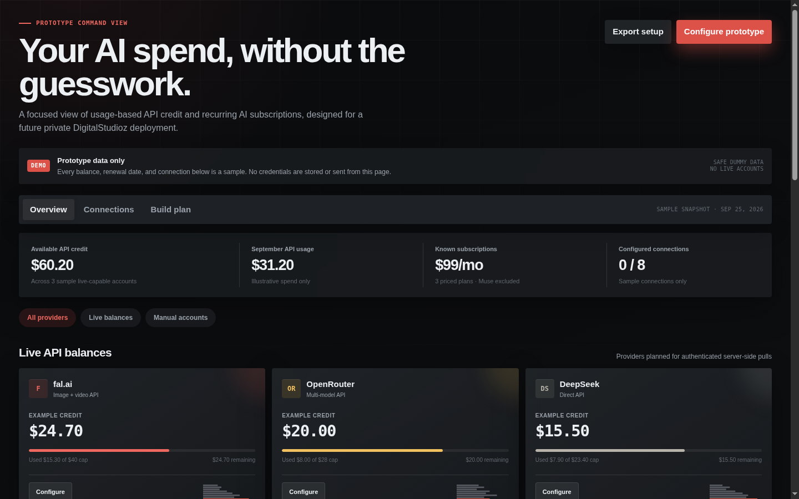

# ⚡ CreditLabz — Trinity Preview

> Trinity's design entry for Jon's **CreditLabz** bake-off — a glassmorphic
> command view of API credit and AI subscriptions, minus the busywork.

[](https://jonbeatz.github.io/creditlabz-trinity-preview/)
[](https://github.com/jonbeatz/creditlabz-trinity-preview/commits/main)
[](https://github.com/jonbeatz/creditlabz-trinity-preview)


**🚀 Live preview:** https://jonbeatz.github.io/creditlabz-trinity-preview/



> **Prototype data only.** Every balance, renewal date, and connection is a
> sample. No credentials are stored or sent from this page.

## What's inside

- **Live API balance cards** — fal.ai, OpenRouter, DeepSeek. Mocked for now,
  planned for authenticated server-side pulls behind the private REST API.
- **Manual account cards** — Higgsfield API, Higgsfield Starter, Cursor,
  Codex, Muse. For services with no public balance endpoint.
- **Higgsfield cashback flag** — the Sept 30 promo deadline stays visible.
- **Spend + coverage charts** — September usage, 7-day shape, coverage vs
  limits.
- **Connections / Build plan tabs** — where the real backend wiring will land.

## Design language

Glassmorphic frosted-glass cards, small tight radius corners, no colored
strokes. Dark charcoal + grays with red and gold accents — no teal, aqua,
or purple. Jon's locked website taste.

## Tech stack

| Layer   | Choice                                                         |
| ------- | -------------------------------------------------------------- |
| Markup  | Single self-contained `index.html` (CSS + JS inlined)          |
| Runtime | None — opens straight in the browser, no build step            |
| Hosting | GitHub Pages, served from `main` (`.nojekyll`, no Jekyll pass) |
| Data    | Dummy/sample data, clearly labeled throughout                  |

## Project structure

```text
creditlabz-trinity-preview/
├── index.html          # the whole app — self-contained build
├── assets/
│   └── screenshot.png  # README hero shot
├── .nojekyll           # tell Pages to serve files as-is
└── README.md
```

## Workflow — branches, not overwrites

`main` always mirrors the latest approved build. Every change gets cut as a
**new branch** off `main` and previewed via GitHub Pages before it lands.
Nothing is silently replaced.

## Use this repo as a template

This README is the house pattern for Jon's preview repos. Copy the shape:
badges → live link → hero screenshot → what's inside → tech stack →
structure → workflow.

## Revision history

- **2026-09-25 — `charcoal-restyle`** — Killed the amber/brown wash: deeper
  charcoal base (`#0a0b0d`), cooled the warm-tinted grays, removed the gold
  background glow. Red is now the lead accent (primary buttons, eyebrow,
  DEMO mark, usage bars); gold kept only for tiny accents and per-card
  service coding. Added: provider facet filter pills (All / Live / Manual),
  live "Nd left" countdown chip on the Higgsfield Sep 30 cashback deadline,
  card hover lift, tabular numerals on balances, red text selection, and
  `prefers-reduced-motion` coverage for the new interactions. Fresh dark-mode
  hero screenshot.
